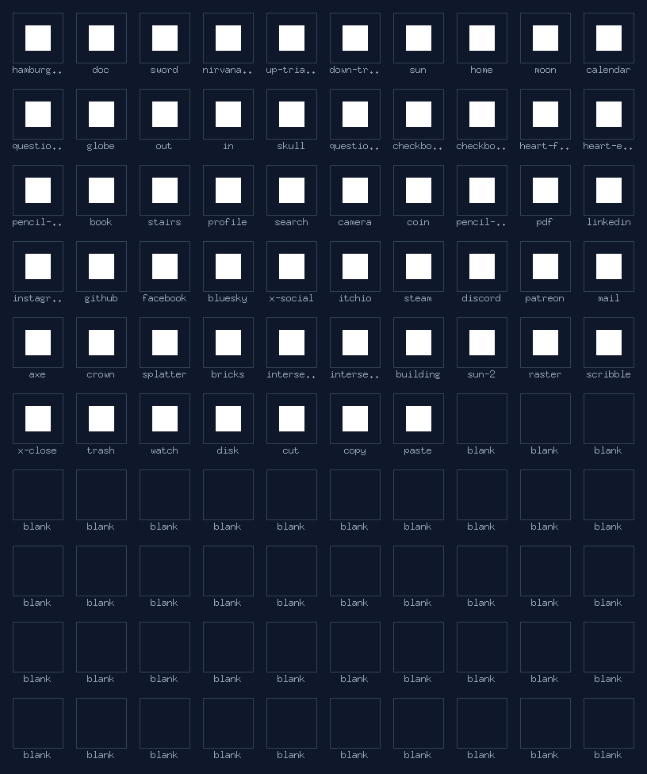

# Go Icon Set
Tool for making a Pixel Art web Icons set from a spritesheet (Asesprite).

## How it works
    -Take a spritesheet.png, tell it the icon size 16x16, number of columns and go.
    -Optional to make a json sheet with names for the icons. Otherwise defaults to numbered.

## Roadmap
    -[] Finish sample icon set
    -[] Make a Templ + Go package
    -[] JavaScript/TypeScript package for React, Next, Nuxt, VanillaJS, etc etc etc





# Use in Templ
## Step 1: Configure Your Global Style (Optional)
- If you don't want to specify colors and sizes every single time you call an icon, you can set a global fallback style right when your main web application starts up (usually in your website's main main.go).

```go
package main

import (
	"net/http"
	// Import your icons package
	"github.com/ngolebiewski/go_icon_set/temple_icons"
)

func main() {
	// Set your preferred global tokens ONCE at launch
	temple_icons.SetGlobalDefaults(temple_icons.IconConfig{
		Size:  "24px",          // All icons will render at 24px by default
		Color: "currentColor",  // Force icons to inherit text colors from CSS classes
	})

	// Start your server ...
}

```

## Step 2: Use the Icons in a .templ File

-Inside any Templ file, import the temple_icons sub-package. Because they are compiled into native templ.Component functions, you can invoke them simply using the @ syntax.

-Create or open a file like components/nav.templ:

```go
package components

import (
	// Import the sub-package path
	"github.com/ngolebiewski/go_icon_set/temple_icons"
)

templ Navigation() {
	<nav class="flex items-center gap-4 bg-slate-900 p-4 text-slate-300">
		
		@temple_icons.Home()
		<span>Home</span>

		@temple_icons.Sword(temple_icons.IconConfig{Size: "2rem", Color: "#f43f5e"})
		<span>Combat</span>

		<div class="text-emerald-400 hover:text-emerald-300 transition-colors">
			@temple_icons.Github(temple_icons.IconConfig{Size: "32px"})
		</div>

	</nav>
}

```